# Neon Arena

<p align="center">
  <strong>Your GitHub year as a neon 3D stadium.</strong>
</p>

<picture>
  <source media="(prefers-color-scheme: light)" srcset="./preview-light.svg">
  
</picture>

Neon Arena turns your GitHub contribution calendar into a single animated SVG for your profile README. Every day is a lit 3D bar or tile on a slab, drawn in true camera perspective, and the slab is framed in glowing neon tubes.

- **LED ticker:** the slab's front face is a dot-matrix screen that scrolls your top repositories and their stars.
- **Stadium board:** an LED board along the back scrolls your headline stats: contributions, active days, longest streak and peak day.
- **Streak light-cycle:** a neon trail rides over the bar tops across your longest streak.
- **Colour wave:** a wave of neon light rolls across the grid.
- **Night and day:** `aurora` on near-black and `daylight` on clean white, with the same neon palette.

It's one self-contained SVG with no runtime dependencies and no hosted service. Use it as a GitHub Action or as a Node.js CLI.

## Use on your profile

### Step 1: add the workflow

Create `.github/workflows/neon-arena.yml` in your profile repository (the repository named after your username):

```yaml
# Copy into your profile repository as .github/workflows/neon-arena.yml
name: Neon Arena

on:
  workflow_dispatch:

  schedule:
    # Refresh once per hour.
    # Minute 17 avoids the top-of-hour schedule spike.
    - cron: "17 * * * *"

permissions:
  contents: write

concurrency:
  group: neon-arena
  cancel-in-progress: true

env:
  # Your local IANA timezone.
  #
  # Examples:
  # India: Asia/Kolkata
  # New York: America/New_York
  # London: Europe/London
  # Tokyo: Asia/Tokyo
  NEON_TIMEZONE: Asia/Kolkata

  # Daylight theme starts at 06:00 local time.
  NEON_DAY_START: "06"

  # Aurora theme starts at 18:00 local time.
  NEON_NIGHT_START: "18"

jobs:
  generate:
    name: Generate Neon Arena
    runs-on: ubuntu-latest

    steps:
      - name: Checkout profile repository
        uses: actions/checkout@f548e57e544e1ff5a4c46bf1e1b8685f8e4a348a # v7.0.1
        with:
          fetch-depth: 0

      - name: Determine local theme
        id: theme
        shell: bash
        env:
          TIMEZONE: ${{ env.NEON_TIMEZONE }}
          DAY_START: ${{ env.NEON_DAY_START }}
          NIGHT_START: ${{ env.NEON_NIGHT_START }}
        run: |
          set -euo pipefail

          echo "Timezone: ${TIMEZONE}"

          if ! TZ="${TIMEZONE}" date >/dev/null 2>&1; then
            echo "ERROR: Invalid IANA timezone: ${TIMEZONE}"
            exit 1
          fi

          HOUR=$(TZ="${TIMEZONE}" date +%H)
          LOCAL_DATE=$(TZ="${TIMEZONE}" date '+%Y-%m-%d %H:%M:%S %Z')

          echo "Local time: ${LOCAL_DATE}"
          echo "Local hour: ${HOUR}"

          if [ "${HOUR}" -ge "${DAY_START}" ] && [ "${HOUR}" -lt "${NIGHT_START}" ]; then
            THEME="daylight"
            MODE="DAY"
          else
            THEME="aurora"
            MODE="NIGHT"
          fi

          echo "Theme: ${THEME}"
          echo "Mode: ${MODE}"

          echo "theme=${THEME}" >> "$GITHUB_OUTPUT"
          echo "mode=${MODE}" >> "$GITHUB_OUTPUT"
          echo "local_time=${LOCAL_DATE}" >> "$GITHUB_OUTPUT"

      - name: Generate Neon Arena
        uses: SandeepKomal/neon-arena@v1.0.0
        with:
          username: ${{ github.repository_owner }}
          github-token: ${{ secrets.GITHUB_TOKEN }}
          theme: ${{ steps.theme.outputs.theme }}
          output: profile/neon-arena.svg

      - name: Validate Neon Arena
        shell: bash
        env:
          SVG: profile/neon-arena.svg
          EXPECTED_LOGIN: ${{ github.repository_owner }}
        run: |
          set -euo pipefail

          test -s "${SVG}"
          grep -q "<svg" "${SVG}"
          grep -q "</svg>" "${SVG}"
          grep -qi "@${EXPECTED_LOGIN}" "${SVG}"
          grep -q "contributions" "${SVG}"
          grep -q "active days" "${SVG}"
          grep -q "current streak" "${SVG}"
          grep -q "longest streak" "${SVG}"

          if grep -q "Ada Example" "${SVG}" || grep -q "ada-example" "${SVG}"; then
            echo "ERROR: Sample profile detected."
            exit 1
          fi

          SIZE=$(wc -c < "${SVG}")
          if [ "${SIZE}" -lt 5000 ]; then
            echo "ERROR: Generated SVG is unexpectedly small."
            exit 1
          fi

          echo "Neon Arena generated successfully."
          echo "SVG size: ${SIZE} bytes"
          echo "Theme: ${{ steps.theme.outputs.theme }}"
          echo "Mode: ${{ steps.theme.outputs.mode }}"

      - name: Commit Neon Arena
        shell: bash
        run: |
          set -euo pipefail

          git config user.name "github-actions[bot]"
          git config user.email "41898282+github-actions[bot]@users.noreply.github.com"

          git add profile/neon-arena.svg

          if git diff --cached --quiet; then
            echo "No Neon Arena changes detected."
            exit 0
          fi

          git commit -m "chore: update Neon Arena (${{ steps.theme.outputs.mode }})"
          git push origin main
```

The workflow refreshes the SVG once an hour, picks the day or night theme from your local time, checks the result and commits it. Change `NEON_TIMEZONE` to your own [IANA time zone](https://en.wikipedia.org/wiki/List_of_tz_database_time_zones).

For production, pin the release tag `v1.0.0` or an immutable commit SHA rather than `main`.

### Step 2: show it in your README

After the workflow runs once, it creates `profile/neon-arena.svg`. Add this to your profile README:

```md

```

Keep the SVG as a file and reference it with an image. Don't paste the SVG into `README.md`.

## Inputs

| Input | Required | Default | Description |
| --- | --- | --- | --- |
| `username` | No | Current repository owner | GitHub username to visualize |
| `github-token` | Yes | — | Token used to query GitHub's GraphQL API |
| `theme` | No | `aurora` | `aurora` or `daylight` |
| `output` | No | `profile/neon-arena.svg` | Output SVG path |
| `no-motion` | No | `false` | Static image: no ticker scroll, streak trail or colour wave |

## Permissions and token handling

Grant the least privilege your workflow needs. The example grants `contents: write` because it commits the generated SVG back to the profile repository.

The Action passes the token through the `GITHUB_TOKEN` environment variable, never on the command line. It requests data directly from `https://api.github.com/graphql` and does not use a hosted rendering service. It only writes the SVG file; it never edits your `README.md`.

Store personal tokens only as encrypted GitHub Actions secrets and never commit them.

## Local CLI

Requires Node.js 18.3 or later.

```bash
npm test
npm run sample        # writes out/preview-dark.svg and out/preview-light.svg from sample data
```

Render your own profile:

```bash
GITHUB_TOKEN=<token> node src/cli.mjs --user YOUR_LOGIN --out profile/neon-arena.svg
```

Options:

```text
--theme aurora|daylight
--no-motion
--sample
--help
```

## How it's built

| Path | Purpose |
| --- | --- |
| `action.yml` | GitHub Action metadata and runner wrapper |
| `src/cli.mjs` | Command-line entry point |
| `src/github.mjs` | GitHub GraphQL data retrieval |
| `src/stats.mjs` | Contribution statistics |
| `src/geometry.mjs` | Perspective camera, prisms and box faces and edges |
| `src/render.mjs` | Scene composition: terrain, materials, neon edges, cards |
| `src/arena.mjs` | LED ticker, stadium board and streak light-cycle |
| `src/neon.mjs` | Neon-tube edges and colour helpers |
| `src/themes.mjs` | Theme colour tokens |
| `src/sample.mjs` | Deterministic sample data |
| `test/` | Unit and rendering tests |

## Security

All profile and repository text is escaped before it goes into SVG markup, and repository language colours are validated before use. Hostile-input tests cover the LED boards, the cards and the repository fields. There are no npm dependencies.

See [SECURITY.md](./SECURITY.md) to report a vulnerability. Please don't disclose details in a public issue.

## Support

Report bugs and request features in the [issue tracker](https://github.com/SandeepKomal/neon-arena/issues).

## Licence

Copyright (c) 2026 Sandeep Komal Pothu. Neon Arena is released under the [MIT License](./LICENSE).

Neon Arena grew out of [Git3D Universe](https://github.com/SandeepKomal/Git3D-Universe), by the same author. See [ORIGINALITY-AND-LICENSING.md](./ORIGINALITY-AND-LICENSING.md) for provenance, [THIRD-PARTY-NOTICES.md](./THIRD-PARTY-NOTICES.md) for the `actions/setup-node` notice, and [EULA.md](./EULA.md) and [PRIVACY.md](./PRIVACY.md) for terms and privacy.

This documentation describes the project's licensing, provenance and security posture. It is not legal advice.
